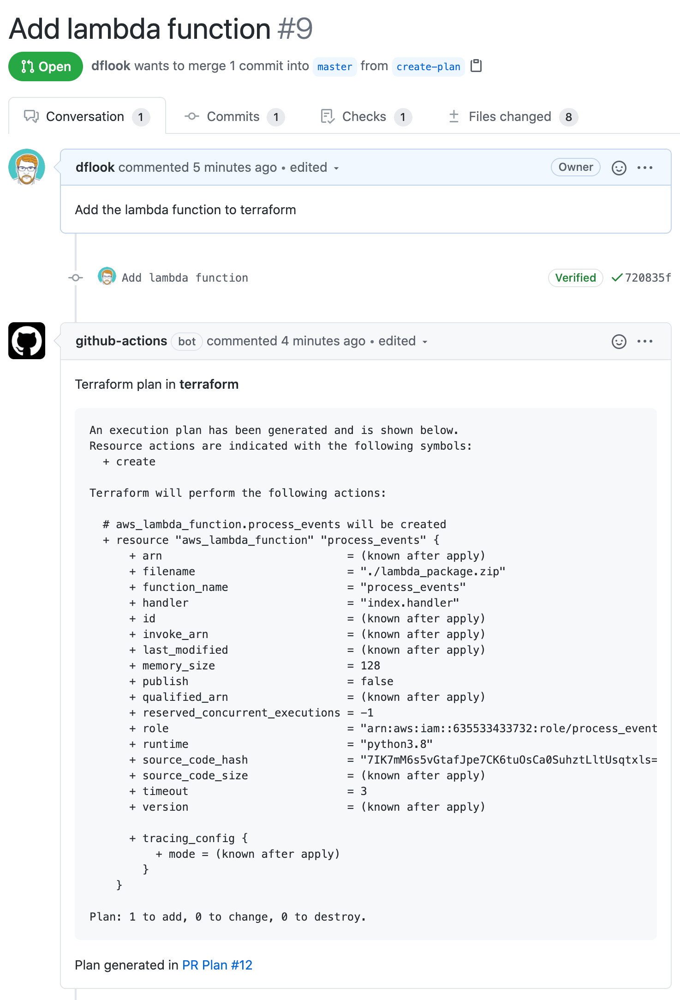

# terraform-plan action

This is one of a suite of terraform related actions - find them at [dflook/terraform-github-actions](https://github.com/dflook/terraform-github-actions).

This actions generates a terraform plan.
If the triggering event relates to a PR it will add a comment on the PR containing the generated plan.

<p align="center">
    
</p>

The `GITHUB_TOKEN` environment variable is must be set for the PR comment to be added.
The action can be run on other events, which prints the plan to the workflow log.

The [dflook/terraform-apply](https://github.com/dflook/terraform-github-actions/tree/master/terraform-apply) action can be used to apply the generated plan.

## Inputs

* `path`

  Path to the terraform configuration

  - Type: string
  - Required

* `workspace`

  Terraform workspace to run the plan for

  - Type: string
  - Optional
  - Default: `default`

* `label`

  An friendly name for the environment the terraform configuration is for.
  This will be used in the PR comment for easy identification.

  It must be the same as the `label` used in the corresponding `terraform-apply` command.

  - Type: string
  - Optional

* `version`

  Override the Terraform binary version. It should be expressed in the
  format used by the Terraform project to identify release versions.

  - Type: string
  - Optional
  - Default: latest

* `var`

  Comma separated list of terraform vars to set

  - Type: string
  - Optional

* `var_file`

  Comma separated list of tfvars files to use.
  Paths should be relative to the GitHub Actions workspace

  - Type: string
  - Optional

* `backend_config`

  Comma separated list of terraform backend config values.

  - Type: string
  - Optional

* `backend_config_file`

  Comma separated list of terraform backend config files to use.
  Paths should be relative to the GitHub Actions workspace

  - Type: string
  - Optional

* `parallelism`

  Limit the number of concurrent operations

  - Type: number
  - Optional
  - Default: 10

* `add_github_comment`

  The default is `true`, which adds a comment to the PR with the generated plan.
  Set to `false` to disable the comment - the plan will still appear in the workflow log.

  - Type: bool
  - Optional
  - Default: true

## Environment Variables

* `GITHUB_TOKEN`

  The GitHub authorization token to use to create comments on a PR.
  The token provided by GitHub Actions can be used - it can be passed by
  using the `${{ secrets.GITHUB_TOKEN }}` expression, e.g.

  ```yaml
  env:
    GITHUB_TOKEN: ${{ secrets.GITHUB_TOKEN }}
  ```

## Outputs

* `changes`

  Set to 'true' if the plan would apply any changes, 'false' if it wouldn't.

  Note that with terraform <0.13 an apply may still be needed to update any outputs, even if no
  resources would change. With terraform >=0.13 this is correctly set to 'true' whenever an apply
  needs to be run.

## Example usage

### Automatically generating a plan

This example workflow runs on every push to an open pull request,
and create or updates a comment with the terraform plan

```yaml
name: PR Plan

on: [pull_request]

jobs:
  plan:
    runs-on: ubuntu-latest
    name: Create terraform plan
    env:
      GITHUB_TOKEN: ${{ secrets.GITHUB_TOKEN }}            
    steps:
      - name: Checkout
        uses: actions/checkout@v2

      - name: terraform plan
        uses: dflook/terraform-plan@v1
        with:
          path: my-terraform-config
```

### Generating a plan using a comment

This workflow generates a plan on demand, triggered by someone
commenting `terraform plan` on the PR. The action will create or update
a comment on the PR with the generated plan.

```yaml
name: Terraform Plan

on: [issue_comment]

jobs:
  plan:
    if: github.event.issue.pull_request && contains(github.event.comment.body, 'terraform plan')
    runs-on: ubuntu-latest
    name: Create terraform plan
    env:
      GITHUB_TOKEN: ${{ secrets.GITHUB_TOKEN }}
    steps:
      - name: Checkout
        uses: actions/checkout@v2
        with:
          ref: refs/pull/${{ github.event.issue.number }}/merge

      - name: terraform plan
        uses: dflook/terraform-plan@v1
        with:
          path: my-terraform-config
```
