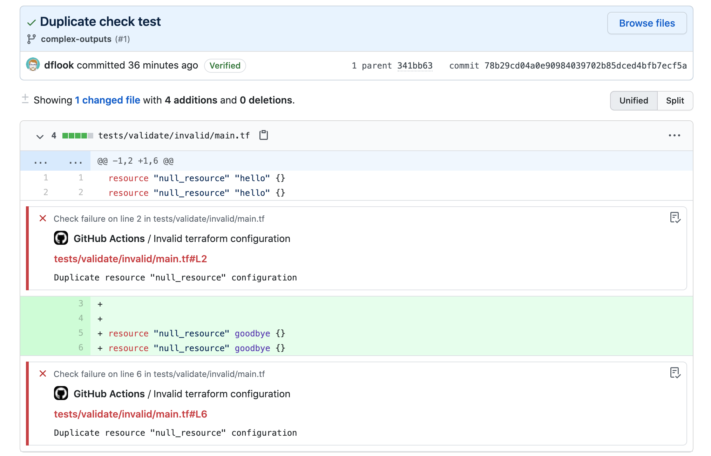

# terraform-validate action

This is one of a suite of terraform related actions - find them at [dflook/terraform-github-actions](https://github.com/dflook/terraform-github-actions).

This action uses the `terraform validate` command to check that a terraform configuration is valid.
This can be used to check that a configuration is valid before creating a plan.

Failing GitHub checks will be added for any problems found.

<p align="center">
    
</p>

If the terraform configuration is not valid, the build is failed.

## Inputs

* `path`

  Path to the terraform root module

  - Type: string
  - Optional
  - Default: The action workspace

* `workspace`

  Terraform workspace to use for the `terraform.workspace` value while validating.

  - Type: string
  - Optional
  - Default: `default`

## Outputs

* `failure-reason`

  When the job outcome is `failure` because the validation failed, this will be set to 'validate-failed'.
  If the job fails for any other reason this will not be set.
  This can be used with the Actions expression syntax to conditionally run a step when the validate fails.

## Environment Variables

* `TERRAFORM_CLOUD_TOKENS`

  API tokens for terraform cloud hosts, of the form `<host>=<token>`. Multiple tokens may be specified, one per line.
  These tokens may be used for fetching required modules from the registry.

  e.g for terraform cloud:
  ```yaml
  env:
    TERRAFORM_CLOUD_TOKENS: app.terraform.io=${{ secrets.TF_CLOUD_TOKEN }}
  ```

  With Terraform Enterprise or other registries:
  ```yaml
  env:
    TERRAFORM_CLOUD_TOKENS: |
      app.terraform.io=${{ secrets.TF_CLOUD_TOKEN }}
      terraform.example.com=${{ secrets.TF_REGISTRY_TOKEN }}
  ```

  - Type: string
  - Optional

* `TERRAFORM_SSH_KEY`

  A SSH private key that terraform will use to fetch git module sources.

  This should be in PEM format.

  For example:
  ```yaml
  env:
    TERRAFORM_SSH_KEY: ${{ secrets.TERRAFORM_SSH_KEY }}
  ```

  - Type: string
  - Optional

* `TERRAFORM_PRE_RUN`

  A set of commands that will be ran prior to `terraform init`. This can be used to customise the environment before running terraform. 
  
  The runtime environment for these actions is subject to change in minor version releases. If using this environment variable, specify the minor version of the action to use.
  
  The runtime image is currently based on `debian:bullseye`, with the command run using `bash -xeo pipefail`.

  For example:
  ```yaml
  env:
    TERRAFORM_PRE_RUN: |
      # Install latest Azure CLI
      curl -skL https://aka.ms/InstallAzureCLIDeb | bash
      
      # Install postgres client
      apt-get install -y --no-install-recommends postgresql-client
  ```

  - Type: string
  - Optional

* `TERRAFORM_HTTP_CREDENTIALS`

  Credentials that will be used for fetching modules sources with `git::http://`, `git::https://`, `http://` & `https://` schemes.

  Credentials have the format `<host>=<username>:<password>`. Multiple credentials may be specified, one per line.

  Each credential is evaluated in order, and the first matching credentials are used. 

  Credentials that are used by git (`git::http://`, `git::https://`) allow a path after the hostname.
  Paths are ignored by `http://` & `https://` schemes.
  For git module sources, a credential matches if each mentioned path segment is an exact match.

  For example:
  ```yaml
  env:
    TERRAFORM_HTTP_CREDENTIALS: |
      example.com=dflook:${{ secrets.HTTPS_PASSWORD }}
      github.com/dflook/terraform-github-actions.git=dflook-actions:${{ secrets.ACTIONS_PAT }}
      github.com/dflook=dflook:${{ secrets.DFLOOK_PAT }}
      github.com=graham:${{ secrets.GITHUB_PAT }}  
  ```

  - Type: string
  - Optional

## Example usage

This example workflow runs on every push and fails if the terraform
configuration is invalid.

```yaml
on: [push]

jobs:
  validate:
    runs-on: ubuntu-latest
    name: Validate terraform
    steps:
      - name: Checkout
        uses: actions/checkout@v2

      - name: terraform validate
        uses: dflook/terraform-validate@v1
        with:
          path: my-terraform-config
```

This example executes a run step only if the validation failed.

```yaml
on: [push]

jobs:
  validate:
    runs-on: ubuntu-latest
    name: Validate terraform
    steps:
      - name: Checkout
        uses: actions/checkout@v2

      - name: terraform validate
        uses: dflook/terraform-validate@v1
        id: validate
        with:
          path: my-terraform-config

      - name: Validate failed
        if: ${{ failure() && steps.validate.outputs.failure-reason == 'validate-failed' }}
        run: echo "terraform validate failed"
```
